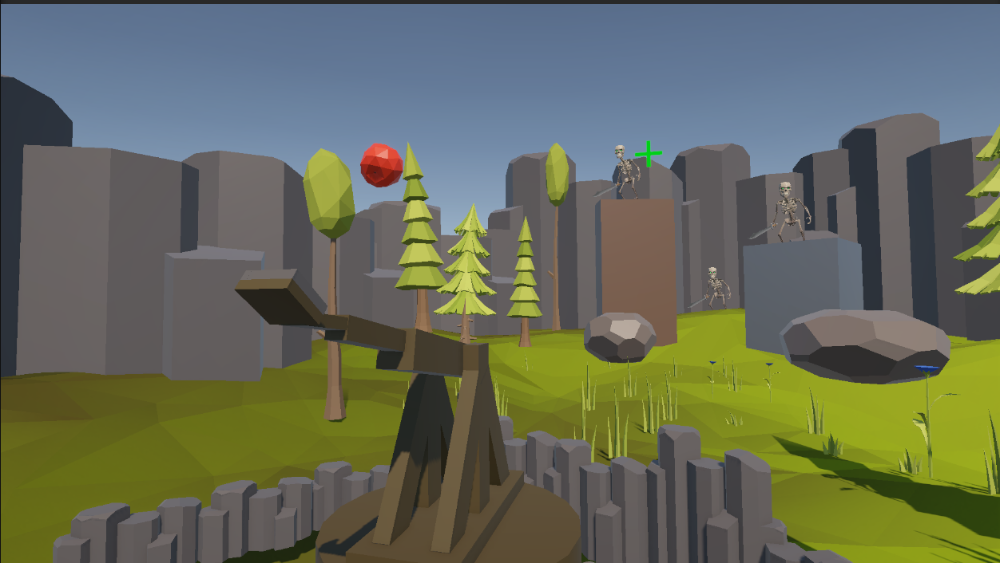
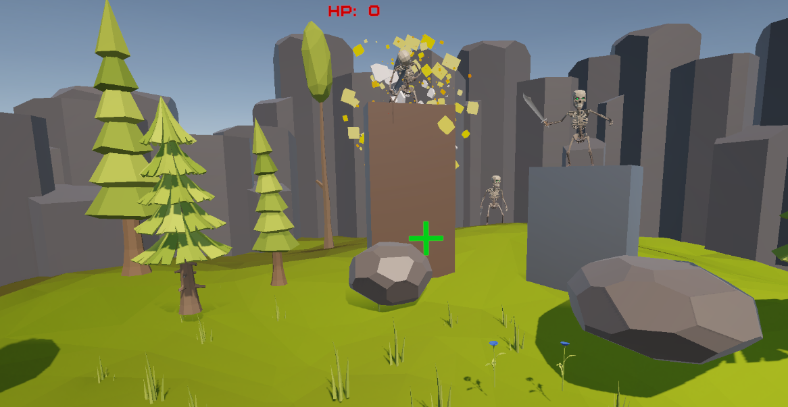

# 🍎 CataFruit


## 🎮 About The Game

**CataFruit** is a 3D physics-based projectile puzzle game developed using **Unity Engine** and **C#**.

The game allows players to launch different fruit projectiles using a catapult system to destroy obstacles, defeat enemies, and complete levels through accurate aiming, projectile calculations, and strategic decision-making.

Inspired by classic physics destruction games, CataFruit focuses on realistic projectile movement, destructible environments, enemy interactions, and level-based challenges.

---

# ✨ Features

## 🍎 Physics-Based Catapult System

Players control a fruit catapult where they can:

- Adjust the launch angle.
- Calculate projectile trajectory.
- Control projectile launching.
- Use different fruits with unique damage values.
- Strategically aim shots to complete each level.

The game uses Unity's physics system combined with custom ballistic calculations to create realistic projectile movement.

---

## 🎯 Projectile and Collision System

CataFruit includes a complete projectile management system:

- Realistic projectile movement.
- Collision detection.
- Damage calculation.
- Projectile tracking.
- Impact effects.
- Object destruction.

Each launched fruit interacts with obstacles and enemies based on its assigned damage value.

---

## 🧱 Destructible Obstacles

Players must destroy different types of obstacles:

- Wood obstacles
- Stone obstacles
- Steel obstacles

Each obstacle has different durability values and receives damage depending on projectile impact.

Features:

- Health-based destruction.
- Damage calculation.
- Destruction effects.
- Physics interaction.

---

## 💀 Enemy System

The game includes enemy characters that must be defeated to complete levels.

Enemy features:

- Health management.
- Damage reception.
- Defeat detection.
- Animation handling.
- Victory condition integration.

---

## 🎮 Level Progression System

CataFruit includes:

- Main menu.
- Multiple gameplay levels.
- Victory panel.
- Game over system.
- Pause menu.
- Restart functionality.
- Next level loading.
- Scene navigation.

---

## 🎨 User Interface System

The game provides UI elements for:

- Current selected fruit.
- Remaining fruits.
- Enemy health.
- Obstacle health.
- Remaining targets.
- Pause controls.
- Victory and defeat screens.

---

## 🔊 Audio System

The audio system supports:

- Main menu music.
- Gameplay music.
- Credits music.
- Volume control.
- Global audio settings.

---

# 🛠️ Technologies Used

| Technology | Purpose |
|---|---|
| Unity Engine | Game development framework |
| C# | Programming language |
| Unity Physics | Projectile and collision simulation |
| Rigidbody System | Object movement and interaction |
| Unity Animator | Character animations |
| TextMeshPro | UI text rendering |
| Unity Particle System | Impact and destruction effects |

---
# 📸 Screenshots





---

# 📜 Script Documentation

## 🎯 Catapult System

### AimRotation.cs

Controls the rotation of the catapult aiming mechanism.

Responsibilities:

- Updates the aiming direction.
- Controls rotation limits.
- Provides player aiming input.

---

### BallisticCalculator.cs

A mathematical utility responsible for projectile trajectory calculations.

Responsibilities:

- Calculates projectile velocity.
- Determines flight path.
- Supports accurate projectile aiming.

---

### CatapultPhysics.cs

Controls the physical behavior of the catapult.

Responsibilities:

- Handles launch physics.
- Applies forces to projectiles.
- Controls projectile release behavior.

---

### ProjectileLauncher.cs

Responsible for launching fruit projectiles.

Responsibilities:

- Instantiates projectiles.
- Applies launch force.
- Communicates with projectile systems.

---

### CatapultGameController.cs

Controls the main gameplay logic.

Responsibilities:

- Manages gameplay state.
- Controls player actions.
- Coordinates gameplay systems.

---

# 🍎 Projectile System

## ProjectileData.cs

Stores projectile information.

Contains:

- Projectile damage.
- Fruit properties.
- Projectile settings.

---

## ProjectileDamage.cs

Handles projectile impact damage.

Responsibilities:

- Detects collisions.
- Applies damage to objects.
- Handles projectile interactions.

---

## ProjectileManager.cs

Controls active projectiles.

Responsibilities:

- Tracks launched projectiles.
- Handles projectile cleanup.
- Manages projectile states.

---

# 🧱 Gameplay Systems

## ObstacleHealth.cs

Controls obstacle durability.

Features:

- Health tracking.
- Damage calculation.
- Destruction handling.

---

## MovingObstacle.cs

Creates moving obstacles.

Supports:

- Horizontal movement.
- Vertical movement.
- Dynamic obstacle challenges.

---

## SkeletonHealth.cs

Controls enemy health.

Responsibilities:

- Receives damage.
- Tracks enemy life.
- Detects defeat.

---

## SkeletonAutoJump.cs

Controls automatic enemy jumping behavior.

Responsibilities:

- Controls skeleton movement animation.
- Adds dynamic enemy behavior.

---

## GameOverController.cs

Handles game failure conditions.

Responsibilities:

- Displays game-over UI.
- Controls defeat state.
- Manages restart options.

---

# 🏆 Level and Scene Management

## LevelVictoryManager.cs

Controls level completion.

Responsibilities:

- Detects victory conditions.
- Displays victory panel.
- Handles completion delay.

---

## SceneNavigationManager.cs

Reusable scene management system.

Handles:

- Loading levels.
- Restarting scenes.
- Returning to main menu.

---

## LevelSettingsManager.cs

Stores and manages level-related settings.

---

## MainMenuUIController.cs

Controls main menu interactions.

Features:

- Start game.
- Navigate scenes.
- Menu buttons.

---

## TutorialManager.cs

Controls tutorial instructions.

Responsibilities:

- Displays gameplay guidance.
- Helps new players understand mechanics.

---

# 🎥 Camera System

## ProjectileCameraFollow.cs

Controls camera movement during projectile flight.

Features:

- Follows launched fruits.
- Creates cinematic gameplay movement.
- Improves player visibility.

---

# 🎨 UI Scripts

## CurrentFruitUI.cs

Displays the currently selected fruit.

---

## FruitCounterUI.cs

Shows remaining available projectiles.

---

## ObstacleHealthUI.cs

Displays obstacle health information.

---

## SkeletonHealthUI.cs

Displays enemy health information.

---

## TargetCounterUI.cs

Tracks remaining objectives.

---

## PauseMenuController.cs

Controls the pause system.

Features:

- Pause gameplay.
- Resume gameplay.
- Restart.
- Exit.

---

# 🔊 Audio Scripts

## MusicManager.cs

Controls background music.

Features:

- Menu music.
- Gameplay music.
- Credits music.
- Audio switching.

---

## GlobalVolumeManager.cs

Manages global audio volume settings.

---

## VolumeSliderUI.cs

Controls volume adjustment through UI.

---

# 📝 Credits System

## CreditsScroller.cs

Creates scrolling credits.

Features:

- Automatic text movement.
- Credits presentation.

---

# 🎯 Utility Scripts

## AnimatorExtension.cs

Provides additional helper functions for Unity Animator components.

Used for:

- Simplifying animation control.
- Improving animation handling.

---

# 🎮 How To Play

1. Select a fruit projectile.
2. Adjust the catapult angle.
3. Set the launch power.
4. Release the fruit.
5. Destroy obstacles.
6. Defeat enemies.
7. Complete the level.

---

# 🚀 Installation

## Requirements

- Unity Hub
- Unity Editor
- C# Development Environment

## Setup

Clone this repository:

```bash
git clone https://github.com/pjaydl/CataFruit.git
